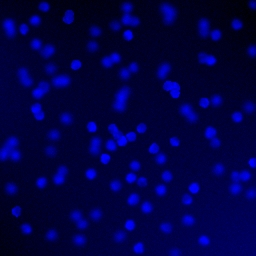
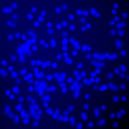

# Image-Feature-Extraction-and-Blob-Detection

### Feature Extraction (Harris Corner Detector)

#### Corner Score
- Implemented `corner_score()` function in `corners.py` to compute SSD-based corner response for given (u,v) offsets
- Generated plots for E(0,5), E(0,-5), E(5,0), and E(-5,0) offsets
- Discussion on Moravec's approach limitations:
  - Computationally expensive due to evaluating multiple offsets at every pixel
  - Requires threshold tuning for different images
  - Doesn't provide unified cornerness measure

#### Harris Corner Detector
- Implemented `harris_detector()` with structure tensor computation
- Used both brute-force and convolution approaches for verification
- Calculated R scores using determinant and trace of M matrix
- Incorporated Gaussian weighting for improved results
- Generated heatmap visualization for 'grace_hopper.png'
- Key observations about corner/edge/flat region responses

### Blob Detection

#### Single-scale Blob Detection
- Implemented `gaussian_filter()` function
- Found optimal σ pairs for large/small circles in 'polka.png'
- Analysis of response maxima and false positives

#### Scale Space Representation
- Implemented `scale_space()` function with S=8, k=√2
- Visualized scale space responses for 'polka.png'
- Observed clear maxima separation between dot sizes

#### Blob Detection
- Experimented with `find_maxima()` parameters:
  - Discussed tradeoffs between window sizes:
    - Larger windows reduce false positives but may miss close blobs
    - Smaller windows more sensitive but noisier

#### Cell Counting
| Input Image | Output Image | Detected Cells |
|-------------|--------------|----------------|
|  |  | 94 |
|  |  | 162 |

- Processed 4 images from ./data/cells:
  1. `174cell.png`: 
     - Detected cells: 94
  2. `164cell.png`: 
     - Detected cells: 162
  3. `116cell.png`: 
     - Detected cells: 137
  4. `106cell.png`: 
     - Detected cells: 94
- Discussion of challenges and improvements:
  - Illumination variations
  - Cell density effects
  - Boundary cases handling
  - Potential enhancements tried

## Implementation Notes
- All functions implemented from scratch without using built-in corner/blob detection libraries
- Included verification steps between brute-force and convolution methods
- Added visualizations for key intermediate results

## How to Run
1. Run corner detection: `python corners.py`
2. Run blob detection: `python blob_detection.py`

## Results
All generated plots and visualizations are included in the `results/` folder.